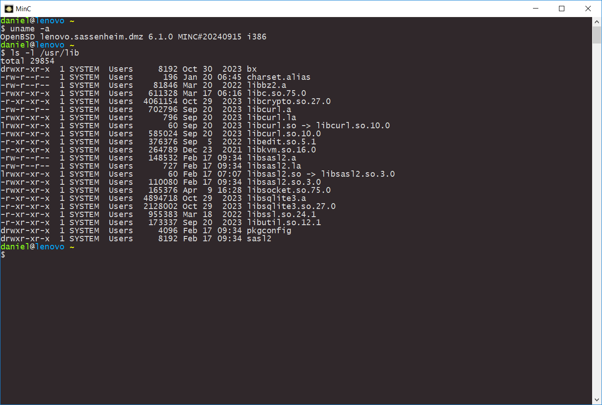

# MinC Is Not Cygwin

MinC was written to help children at vocational education learn Linux without the
hassle of virtualization. It runs on Windows NT, version 2000/XP/2003/Vista/7/8/10/11.

MinC has a tiny kernel emulation (285Kb) which runs on Windows. The rest of the software was
taken verbatim from OpenBSD, version 6.1. This means that by installing MinC, you run OpenBSD
on your Windows machine at native speed.

I wanted the kernel emulation to be as simple as possible, so unexperienced programmers
can contribute to the project. The project has already been discussed on Hacker News, but I plan
to do a write-up with the design decisions I made.

To build MinC from scratch you need the MinGW GCC build tools. It is not advisable
to attempt this at the moment. The build process is not yet fully automated.

For downloading the installer and more information go to: https://minc.commandlinerevolution.nl/english/home.html
